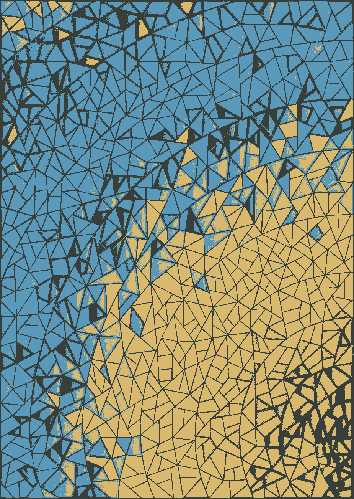
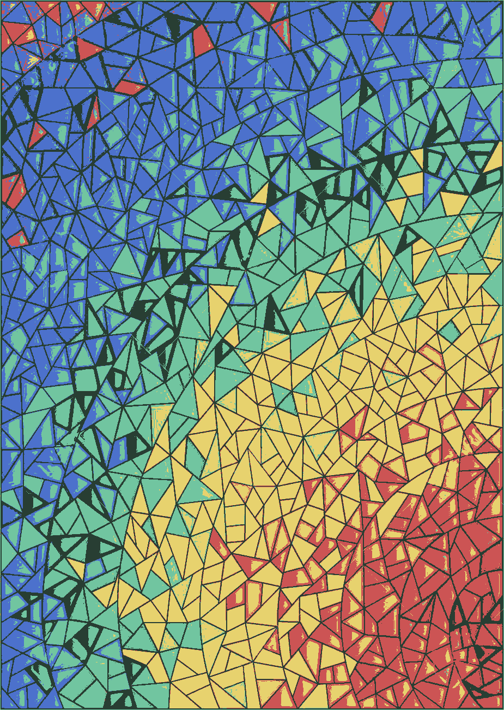
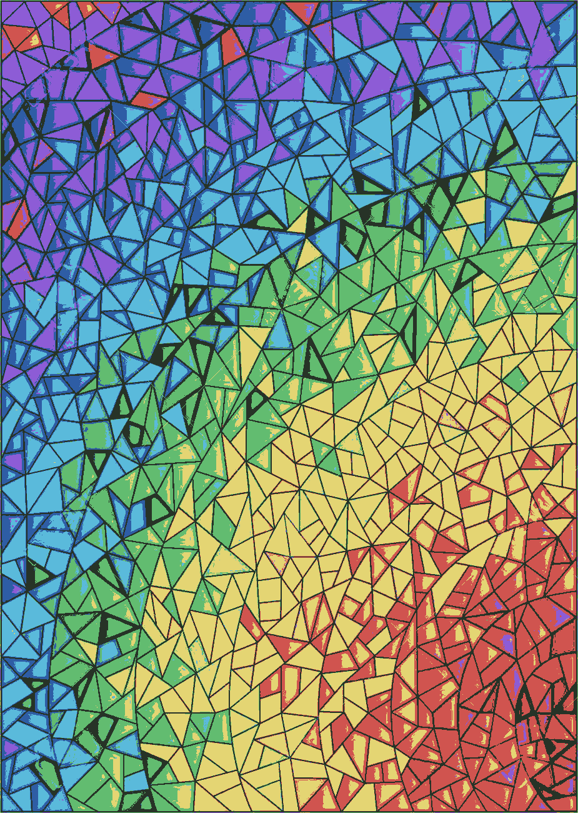

# K-means Clustering Project

## Thông tin cá nhân

* **Họ và tên:** Bùi Vũ Hiếu Phụng
* **MSSV:** 18127185

--------------------------------------------------------

## Mô tả

### Ý tưởng thực hiện

* Mỗi điểm ảnh là một vector $\vec{v} =\begin{bmatrix} v_1 & v_2 & v_3 \end{bmatrix}$ với $v_1,\ v_2,\ v_3$ lần lượt tượng trưng cho kênh màu Red, Green, Blue (RGB)

* Gồm các bước chính sau:
  * Xử lí hình ảnh: Đưa vào một bức ảnh, chuyển nó về ma trận phù hợp với tham số của hàm K-means
  * Chạy thuật toán K-means Clustering
  * Hiển thị kết quả: Chuyển output của hàm K-means thành ảnh và đưa ra màn hình notebook. Đồng thời lưu lại thành file
  
  

#### K-means Clustering 

* **Bước 1:** Khởi tạo centroids (2 mode: `random` - ngẫu nhiên và `in_pixels` - chọn trong ảnh)

  $\rightarrow$ Centroid là một vector cũng có dạng $\vec{u} =\begin{bmatrix} u_1 & u_2 & u_3 \end{bmatrix}$ 

* **Bước 2:** Label cho các điểm ảnh

  * Label của điểm ảnh là index của centroid mà khoảng cách Euclide từ điểm ảnh đến centroid đó là gần nhất
  
    $\rightarrow$ Khoảng cách đó là Euclidean distance giữa hai vector: $d(\vec{v}, \vec{u})= \| \vec{v}-\vec{u}\|=\sqrt{(v_1-u_1)^2+(v_2-u_2)^2+(v_3-u_3)^2}$
  
* **Bước 3:** Cập nhật lại centroid

  * Centroid mới là trung bình của các điểm ảnh thuộc cluster của centroid cũ đó

  * Tại cluster `i`, ta có các điểm ảnh thuộc cluster đó là:

    $\vec{p_1} =\begin{bmatrix} p_{11} & p_{12} & p_{13} \end{bmatrix}\\
    \vec{p_2} =\begin{bmatrix} p_{21} & p_{22} & p_{23} \end{bmatrix}\\
    ...\\
    \vec{p_n} =\begin{bmatrix} p_{n1} & p_{n2} & p_{n3} \end{bmatrix}\\$

    Thì centroid mới là: $\vec{c} =\begin{bmatrix} \frac{p_{11}+p_{21}+...+p_{n1}}{n} & \frac{p_{12}+p_{22}+...+p_{n2}}{n} & \frac{p_{13}+p_{23}+...+p_{n3}}{n} \end{bmatrix}$

* **Bước 4:** Lặp lại bước 2 và 3 cho tới khi thỏa điều kiện dừng

**Điều kiện dừng:** Trong mã giả của hàm, tồn tại biến `max_iter`. Khi số lần chạy K-means bằng `max_iter `, ta đạt điều kiện dừng của hàm.

### Mô tả hàm

#### Thuật toán K-means Clustering

`def initialize_centroids(img, k_clusters, init_type)`

* Khởi tạo centroids
* Input:
  * `img`: Ảnh dưới dạng `np.ndarray` 1 chiều
  * `k_clusters`: Số cluster dạng `int`, bao nhiêu cluster bấy nhiêu centroid
  * `init_type`: mode để sinh centroids dạng `str`, bao gồm `random` và `in_pixels`
* Output:
  
  * `centroids`: `np.ndarray` có `k_clusters` chiều chứa các centroids
* Các hàm của `numpy` đã dùng:
  * `np.random.randint()`: Để random ngẫu nhiên thành các vector trong mode `random`
  * `mp.random.choice()`: Để chọn ngẫu nhiên một số vector thuộc ảnh trong mode `in_pixels` 
  
  

`def label_pixels(img, centroids)`

* Dán label cho từng điểm ảnh
* Input:
  * `img`: Ảnh dưới dạng `np.ndarray` 1 chiều
  * `centroids`: `np.ndarray` chứa các centroids
* Output:
  
  * `labels`: `np.ndarray` chứa label của mỗi điểm ảnh, trong đó tại index `i` là label của pixel thứ `i` trong ảnh
* Các hàm của `numpy` đã dùng:
  * `np.linalg.norm()`: Để tính khoảng cách như đã định nghĩa bằng công thức ở  [Ý tưởng thực hiện](####K-means Clustering)
  * `np.argmin()`: Để tìm index của centroid có khoảng cách đến điểm ảnh nhỏ nhất
  
  

`def update_centroids(img, labels, old_centroids)`

* Cập nhật lại centroids
* Input:
  * `img`: Ảnh dưới dạng `np.ndarray` 1 chiều
  * `labels`: `np.ndarray` chứa label của mỗi điểm ảnh
  * `old_centroids`: `np.ndarray` chứa các centroids cũ
* Output:
  
  * `centroids`: `np.ndarray` chứa các centroid mới
* Các hàm của `numpy` đã dùng:
  
  * `np.means()`: Để tìm centroid mới như đã định nghĩa bằng công thức ở  [Ý tưởng thực hiện](####K-means Clustering)
  
  

`def kmeans(img_1d, k_clusters, max_iter, init_centroids)`

* Chạy thuật toán K-means Clustering, gọi lại các hàm ở trên

* Input:

  * `img_1d`: Ảnh dưới dạng `np.ndarray` 1 chiều
  * `k_clusters`:  Số lượng cluster `int`
  * `max_iter`:  Số lần chạy K-means `int`
  * `init_centroids`: mode để sinh centroids dạng `str`, bao gồm `random` và `in_pixels`
* Output:

  * `centroids`: `np.ndarray` chứa các centroid sau khi chạy xong thuật toán
  * `labels`: `np.ndarray` chứa các label sau khi chạy xong thuật toán 
  
  

#### Xử lí ảnh (không nằm trong hàm)

* Mở ảnh và chuyển ảnh thành array: `pillow` a.k.a. `PIL` và `numpy`
* Chuyển ảnh thành mảng 1 chiều: `np.reshape()`

#### Hiển thị kết quả (không nằm trong hàm)

* Với mỗi điểm ảnh, thay nó bằng centroid ứng với label của điểm ảnh đó
* Khôi phục shape của ảnh gốc
* Hiển thị ảnh trực tiếp: ` matplotlib.pyplot.imshow()`
* Xuất ra file: `PIL.Image.save()`

----------------------------------------------------------------

## Kết quả minh họa

* **Ảnh gốc**

* **Với k = 3, max_iter = 10, init_centroids = 'random'**

* **Với k = 5, max_iter = 10, init_centroids = 'random'**

* **Với k = 7, max_iter = 10, init_centroids = 'random'**

-------------------------------------------------

## Nhận xét

* Với số cluster càng lớn hay số lượng màu lớn, hình ảnh càng được bảo toàn và rõ nét
* Thời gian chạy tỉ lệ thuận với số cluster